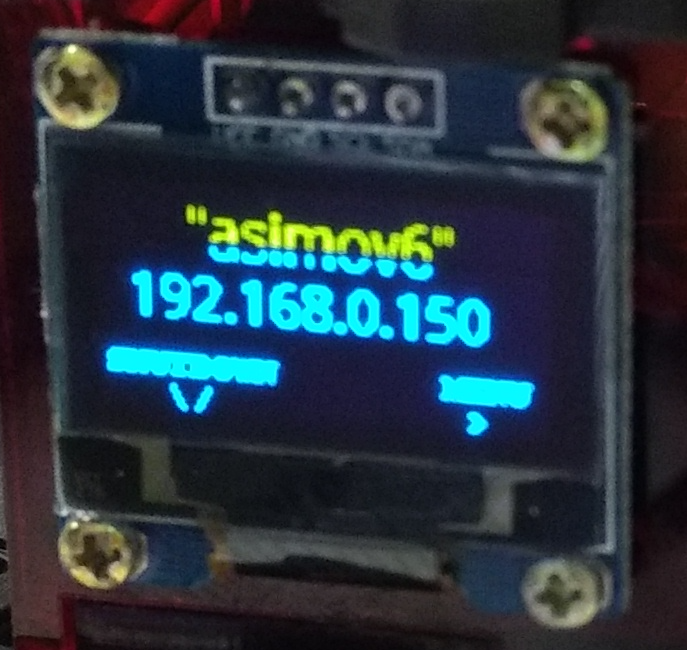

# Bringup do Turtlebot Burger

## Preparações

Anote o número do seu robô. Cada *dupla* de alunos terá um robô principal ao longo do semestre.


Conecte a bateria, ligue o robô e espere o boot terminar. Ambos os procedimentos estão descritos [nesta página](turtlebot_procedimentos.md)


**Fique na mesma rede que o robô**


Para prosseguir, você precisa ter o **endereço IP do robô** Este endereço é visível na tela. Por exemplo, para o robô abaixo este endereço é `192.168.0.150` e o *SSID* ou nome da sua rede *wi-fi* é `asimov6` .





## Configuração do `.bashrc`

Edite seu `.bashrc` para refletir o endereço IP do seu robô e o modelo Burger. 

Verifique se as linhas `IPBerry` , `ROS_MASTER_URI`  e `ROS_IP` são semelhantes ao abaixo:

```bash

export IPBerry=192.168.0.150
export ROS_MASTER_URI="http://"$IPBerry":11311"
export ROS_IP=`hostname -I`


```

Depois de editar, salve e **feche o terminal**.


## Para prosseguir

**Abra um novo terminal** após ter editado seu `.bashrc`. 

Agora execute a central do ROS:

	roscore

Depois, num outro terminal:

	roslaunch turtlebot3_bringup turtlebot3_remote.launch


## Rviz - visualizar dados de sensores

Depois, finalmente em mais um terminal:


	rosrun rviz rviz -d `rospack find turtlebot3_description`/rviz/model.rviz


## Câmera

Para ver a imagem da câmera:

	rqt_image_view

Sempre que a câmera estiver invertida, rode para ajustá-la:

	rosrun rqt_reconfigure rqt_reconfigure


## Controle remoto


Para comandar o robô usando as teclas faça:

	roslaunch turtlebot3_teleop turtlebot3_teleop_key.launch


## No robô novamente, para desligar

Aperte o botão para baixo até o laser para de desligar.


Referência: [Manual do Bringup do Turtlebot3 - documentação oficial](http://emanual.robotis.com/docs/en/platform/turtlebot3/bringup/#bringup)

## Erros e soluções

### invalid ROS_IP (port should not be included)

Se você tiver o erro `invalid ROS_IP (port should not be included)`  significa que você deve ter mais de uma rede ativa em sua máquina.

Neste caso, descubra o que está errado com a variável `ROS_IP` com o comando `echo $ROS_IP` :

``` bash
borg@ubuntu:~$ echo $ROS_IP
10.211.55.30 192.168.0.142 fdb2:2c26:f4e4:0:80a7:77b8:b817:cdaf fdb2:2c26:f4e4:0:d7:c701:113c:f996
```

O print acima permite ver que a variável `ROS_IP` contém muito mais que um único endereço. 

Para consertar precisamos editar o `.bashrc`  e consertar a`variável manualmente. Ficará:

```bash
#export ROS_IP=`hostname -I`
export ROS_IP=192.168.0.142
```
Após este conserto, feche os terminais e tente novamente


	


